# Linking GWAS to pharmacological treatments for psychiatric disorders
[](https://zenodo.org/badge/latestdoi/94279070)

This repository provides Matlab, R and MAGMA code for reproducing results presented in the manuscript entitled:

- Arnatkeviciute et al. (2022) [:green_book: 'Linking GWAS to pharmacological treatments for psychiatric disorders'](https://t.co/AKmyF8wv9e)

The code was written using MATLAB_R2020b.

:envelope: Contact Aurina Arnatkeviciute by [email](mailto:aurina.arnatkeviciute@monash.edu).


## Data Information

#### :dna: GWAS summary statistics:
1. ADHD GWAS summary statistics based on [:green_book: 'Demontis et al (2023)'](https://doi.org/10.1038/s41588-022-01285-8)
2. Bipolar disorder GWAS summary statistics based on [:green_book: 'Mullins et al (2021)'](https://doi.org/10.1038/s41588-021-00857-4)
3. Major depression GWAS summary statistics based on [:green_book: 'Als et al (2023)'](https://doi.org/10.1038/s41591-023-02352-1)
4. Schizophrenia GWAS summary statistics based on [:green_book: 'Trubetskoy et al (2022)'](https://doi.org/10.1038/s41586-022-04434-5)
5. Diabetes GWAS summary statistics based on [:green_book: 'Mahajan et al (2022)'](https://doi.org/10.1038/s41588-022-01058-3)
6. Heart failure GWAS summary statistics based on [:green_book: 'Shah et al (2021)'](https://doi.org/10.1038/s41467-019-13690-5)
7. Inflammatory bowel disease GWAS summary statistics based on [:green_book: 'Lange et al (2017)'](https://doi.org/10.1038/ng.3760)
8. Rheumatoid arthritis GWAS summary statistics based on [:green_book: 'Okada et al (2013)'](https://doi.org/10.1038/nature12873)

#### :books: PPI network data

`9606.protein.links.v12.0.txt.gz (83.2 Mb)` and `9606.protein.info.v12.0.txt.gz (1.9 Mb)` - downloaded from [:books: 'STRING database (version 12.0)'](https://string-db.org/cgi/download.pl?sessionId=a1fHJhN5R9Md&species_text=Homo+sapiens) on the 26th of February 2024;

#### :pill: Treatments lists
Treatments for different conditions of interest were selected by searching the [:medical_symbol: 'DrugBank database'](www.drugbank.ca), accessed on September 3, 2020.
Specifically, drugs for each indication were searched in the DrugBank database using the following search terms:
1. "attention deficit" (for ADHD);
2. "bipolar" (for bipolar disorder) excluding "bipolar depression";
3. "schizophrenia" (for schizophrenia);
4. "major depression" (for major depression);
5. "diabetes" (for type 2 diabetes) excluding "type I diabetes" and "diabetes insipidus";
6. "heart failure" (for heart failure);
7. "Crohn's" and "ulcerative colitis" (for inflammatory bowel disease"); and
8. "rheumatoid arthritis" (for rheumatoid arthritis).
   
#### :books: Treatment targets
The list of genes used in all analyses is based on the combined set of all approved treatment targets from the [:books: 'DrugBank database (version $5.1.11)'](https://go.drugbank.com/), downloaded on the 26th of February 2024.

## Workflow

### Data files

Data files required for this project are located hosted on [this Figshare repository](https://figshare.com/s/3fdbdfa3a3138103e1e4). Raw data files are located in `data.zip`. Enrichment analysis results and associated files are located in `enrichment_2024.zip`.
To perform all analyses and process the data from raw files, please download and place `data` and `enrichment_2024` folders in the root directory (23.35 GB when unzipped).
If you would like to process all data, please follow the instructions in the data **"Data processing"** section.
If you would like only to reproduce figures presented in the manuscript, please download pre-processed data `DataOutput_2024.zip` as well as the enrichment analysis results `enrichment_2024.zip`, unzip and place the `DataOutput_2024` (812.2 MB when unzipped) and `enrichment_2024` folders in the root directory.
This will allow to work with processed data and reproduce the figures immediately (data processing from raw files takes several days).
To reproduce figures, move to the **"Analysis"** section.

### Data processing
First, add all sub-folders to the path using `startup()` function from the root directory.
All scripts and functions need to be run from the root directory that contains `data` folder and other folders created running the `startup()` function.
As a result, the contents of the root directory should be as follows:


#### :label: Aggregate PPI-based information
Information on the PPI data (file: `9606.protein.links.v12.0.txt`) can be found in `data/PPIdata/README_PPI.txt`
1. Replace protein IDs with gene names using `make_PPI_linkfile()`;
2. Generate a binary PPI network thresholded at different evidence thresholds: 0,400,600,900:
```matlab
% BINARY networks:

PPIthrs = [0,400,600,900];
for t=1:length(PPIthrs)   
    % save PPI Adj and distance matrix
    [AdjPPI,geneNames] = PPINImport(false, PPIthrs(t), 'HGNCmatch');
    distMatrix = ComputePPIDist(PPIthrs(t), false);  
end
% WEIGHTED network:

[AdjPPI,geneNames] = PPINImport(true);
```
These commands will save `PPI_HGNC_Adj_th0.mat/PPI_HGNC_Dist_th0.mat/PPI_HGNC_geneLabels_th0.mat` files.   

#### :label: Aggregate drug target information

1. Combine drug target information from `.txt` files into matlab format
```matlab
dataTable = give_drugTargets('all', 'drugbank');
```
This will save `drugTargets_2024_all_drugbank.mat` file;

#### :label: Aggregate GWAS-based information

1. Map genes based on GWAS summary statistics for each disorder using `HMAGMA_code_2024.sh`. Files generated using this script are already placed in `GWASlists/GWASgenes_2022`, so this step can be skipped.
To run the script, first modify paths in lines 1-5 of `code/DataProcessing/HMAGMA/HMAGMA_code_2024.sh` to indicate the location of code, .annot files, and reference genome. Takes several days to run for all disorders and mapping methods.

3. Gene names are in the `ENSG` format. Get gene name to entrezID mapping using `code/DataProcessing/HMAGMA/get_BIOMARTdata.R`.
The output is saved to `BIOMART_geneIDs.txt` (this file is already saved in `GWASlists`); 

4. Update gene IDs for MAGMA outputs and collate all results into a single .mat file:
```matlab
save_MAGMAHresults()
```
To generate data using an older set of GWAS summary statistics:
```matlab
save_MAGMAHresults('2021')
```

4. Create GWAS-based gene scores and save them for each disorder and each set of GWAS summary statistics:
```matlab
GenerateResultsTables()
```
To generate data using an older set of GWAS summary statistics:
```matlab
GenerateResultsTables('2021')
```

This will create `geneScores` structure for each disorder (takes several hours to run).

#### :label: Generate drug-based nulls

Generate 5000 drug-based null vectors for each disorder.
For each disorder, a corresponding number of random drugs is selected and treatment-based scores are calculated across all 2232 genes;   
For example, there are 14 drugs for ADHD, 22 for bipolar disorder, and 45 for diabetes, so for each disorder that number of random treatments is selected.
```matlab
generate_randomDrug_nulls('drugbank')
```

Generate null vectors based on psychiatric disorder drugs only
```matlab
generate_randomDrug_nulls('proportionalPsych')
```

### Analysis

#### :scroll: Reproduce results presented in the manuscript:

For psychiatric disorders and diabetes (`Figure 2`, `Figure 3`, `Figure S1`, `Figure S2`, `Figure S4`) generate figures using:
```matlab
plot_Psych_figures()
```
`Figure 2` - The correspondence between treatment targets and genes implicated in GWAS data for each disorder.
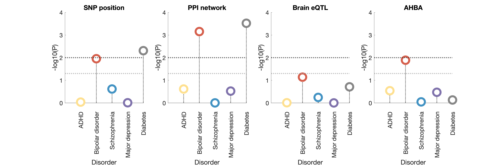

`Figure 3` - The correspondence between treatment targets and genes implicated in a GWAS for each disorder across different mapping methods.

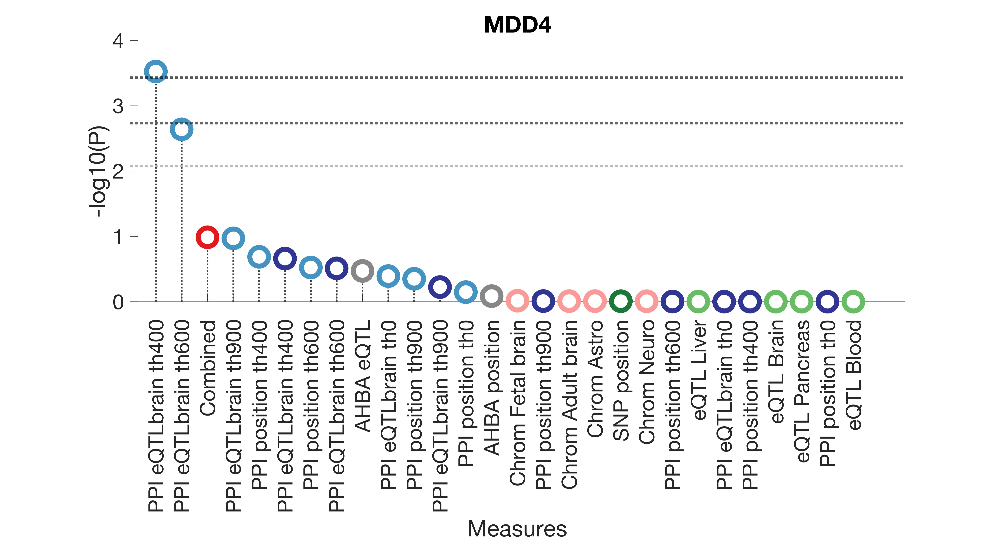
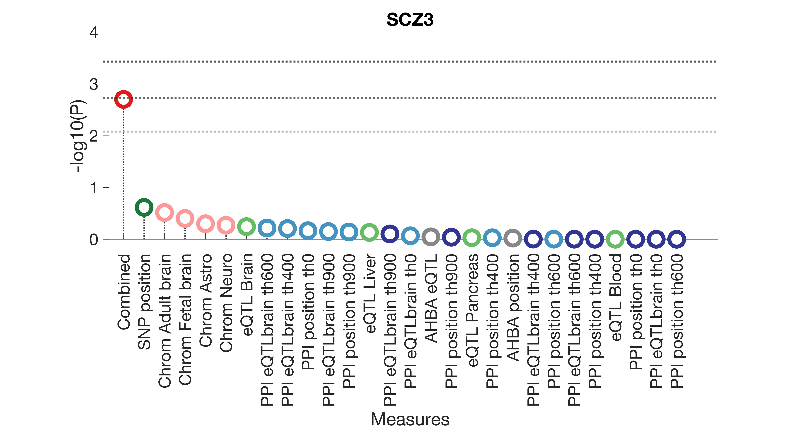
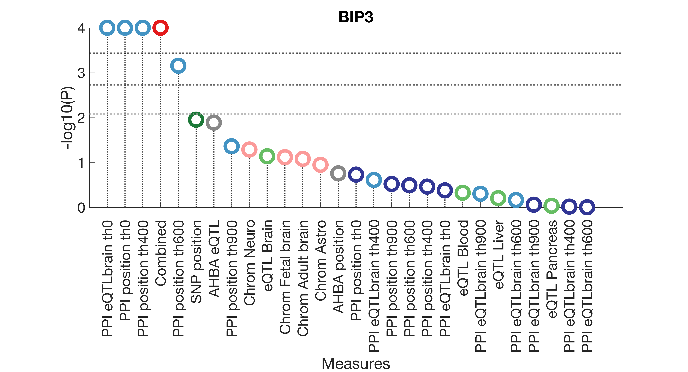
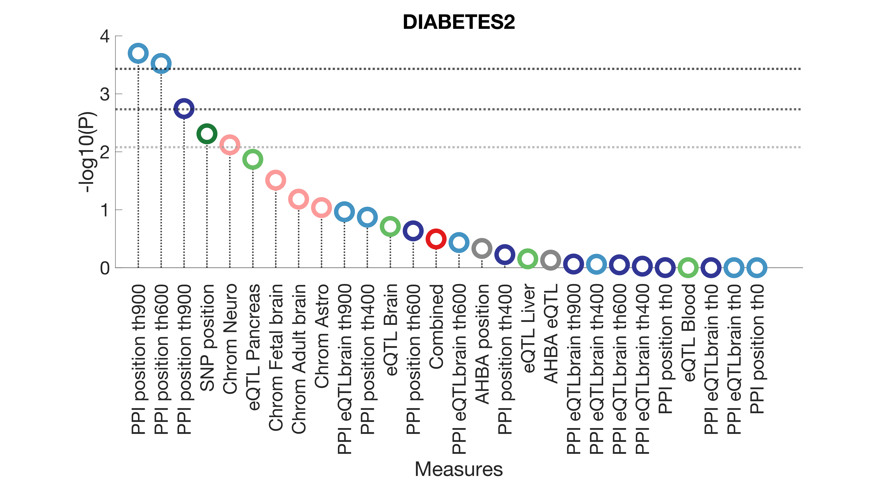

`Figure S1` - The pairwise correspondence between treatment targets and genes implicated in GWAS for each disorder.

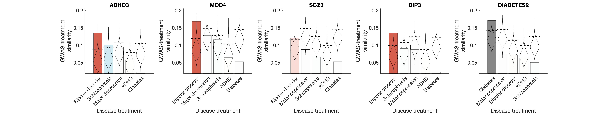


`Figure S2` - Correlation between mapping methods.

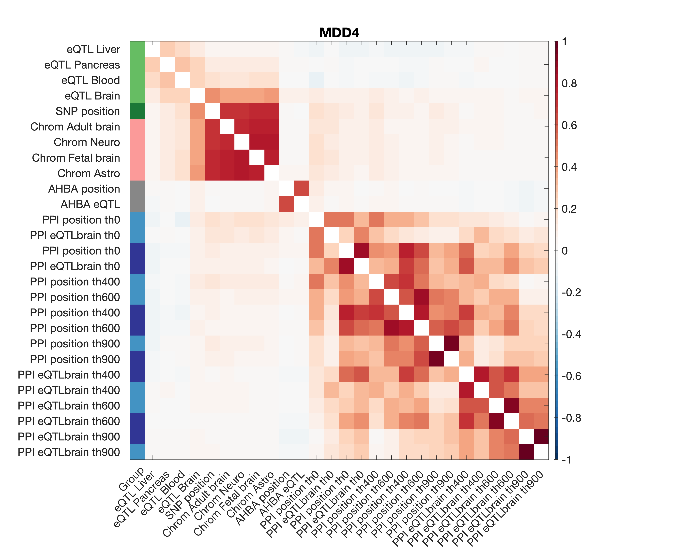


`Figure S4` - The comparison of different null models for significance testing.


For non-psychiatric disorders (`Figure S3`):
```matlab
plot_Body_figures()
```
`Figure S3` - The correspondence between treatment targets and genes implicated in a GWAS for non-psychiatric disorders across different mapping methods.
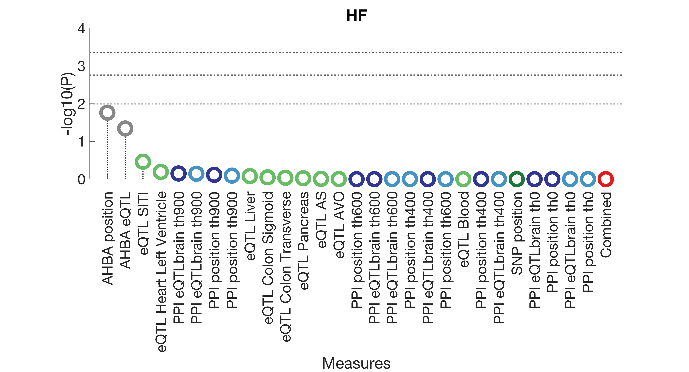


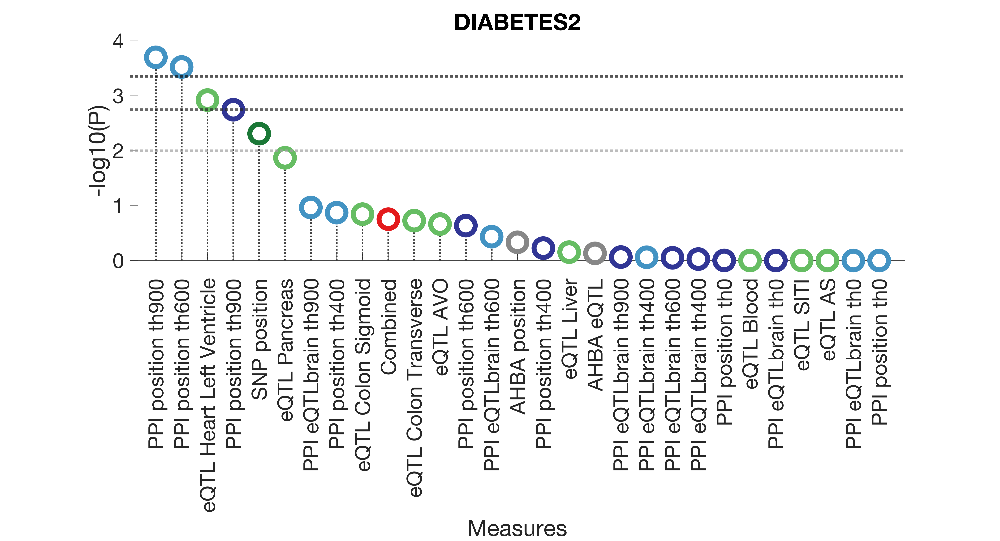


Score individual genes based on their contribution to the similarity score (`Table S1`):
```matlab
TpBIP = rank_gene_contribution('BIP3', 'BIP', 'PPI_mapped_th600');
TpDIABETES = rank_gene_contribution('DIABETES2', 'DIABETES', 'PPI_mapped_th600');
```

Save gene scores for enrichment analysis:
```matlab
save_enrichment_scores()
```

Run the enrichment analysis using ermineJ software (see more detail in the manuscript), and save the results from each analysis in the `enrichment_2024/output` folder.
Enrichment analysis results derived from ermineJ are already provided. Aggregate results using:
```matlab
save_enrichment_results();
```


For replicating results using an alternative set of GWAS summary statistics (`Figure S5`, `Figure S6`, `Figure S7`) generate figures using:
```matlab
plot_Psych_figures_2021()
```

`Figure S5` - The correspondence between treatment targets and genes implicated in GWAS data for each disorder.
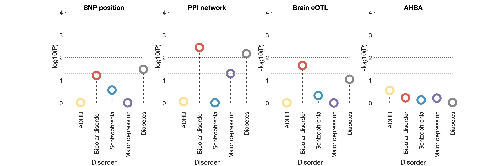

`Figure S6` - The correspondence between treatment targets and genes implicated in a GWAS for each disorder across different mapping methods.


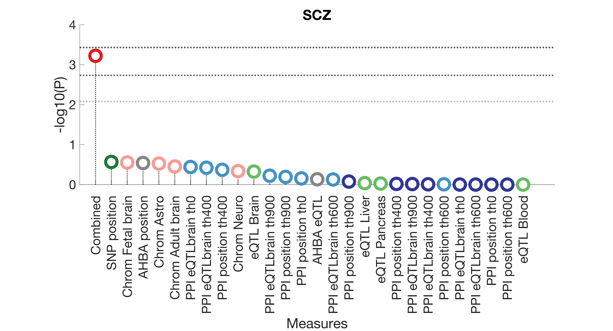
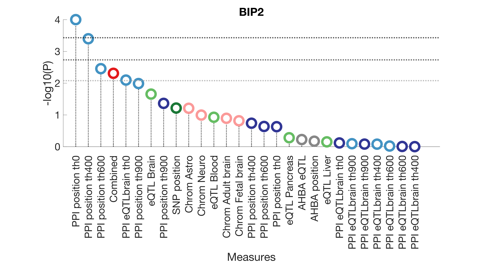


`Figure S7` - The pairwise correspondence between treatment targets and genes implicated in GWAS for each disorder.
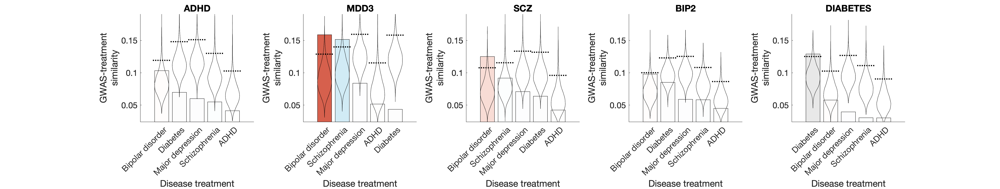

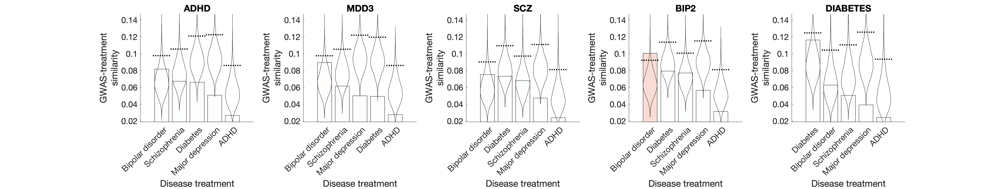

